# Inventory Agent Architecture

This document provides comprehensive architectural documentation for the inventory-agent Windows Service, including UML class diagrams, entity relationships, and sequence diagrams.

## Table of Contents

1. [Overview](#overview)
2. [Module Dependency Diagram](#module-dependency-diagram)
3. [UML Class Diagrams](#uml-class-diagrams)
4. [Entity Relationship Diagram](#entity-relationship-diagram)
5. [Sequence Diagrams](#sequence-diagrams)

---

## Overview

The inventory-agent is a Windows Service written in Rust that periodically collects endpoint hardware/user inventory data via WMI queries and POSTs the collected data as JSON to a central inventory-server.

**Key Components:**
- **main.rs** - Application entry point (service, test, or debug mode)
- **service.rs** - Windows Service registration and control loop
- **config.rs** - Configuration loading from TOML and environment variables
- **collector.rs** - WMI queries for system data collection
- **sender.rs** - HTTP POST to server endpoint
- **models.rs** - Data structures for CheckIn and Drive

---

## Module Dependency Diagram

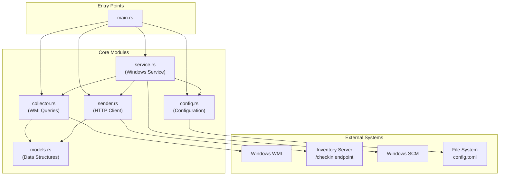

---

## UML Class Diagrams

### Data Models

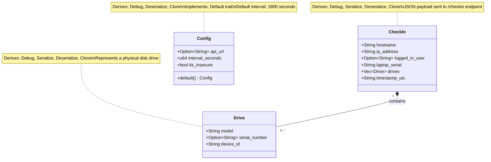

### Internal WMI Structs (collector.rs)

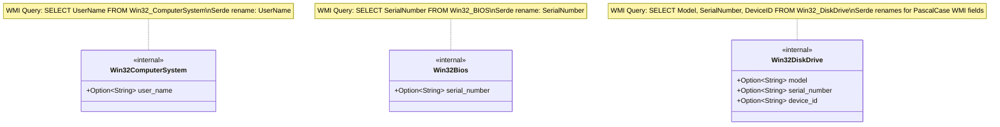

### Module Functions

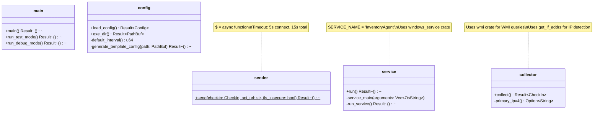

---

## Entity Relationship Diagram

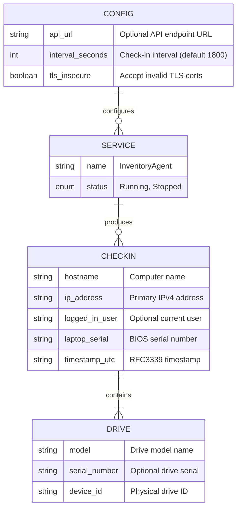

---

## Sequence Diagrams

### Windows Service Execution Flow

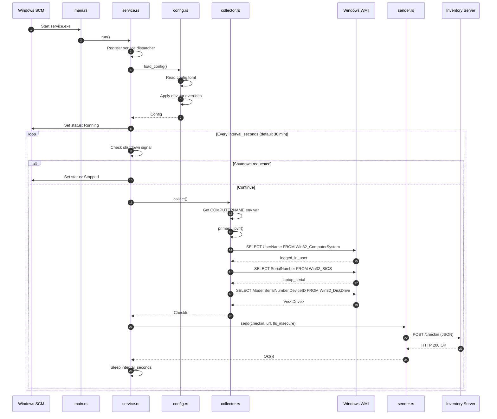

### Test Mode Execution Flow (--test)

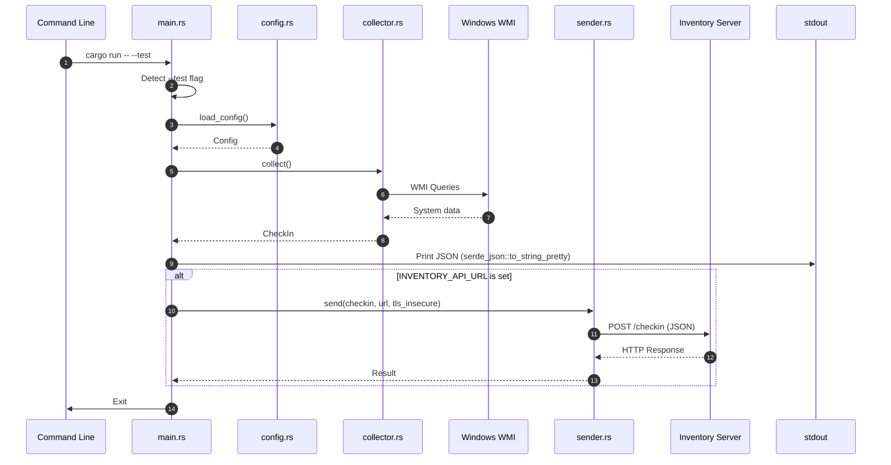

### Debug Mode Execution Flow (--debug)

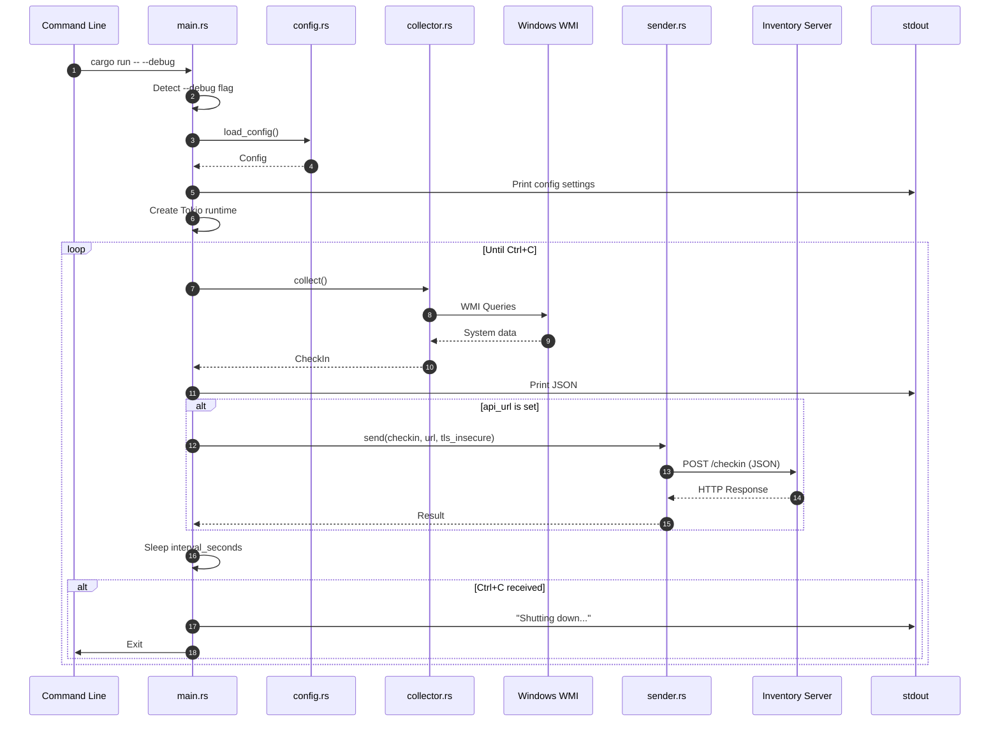

### Configuration Loading Flow

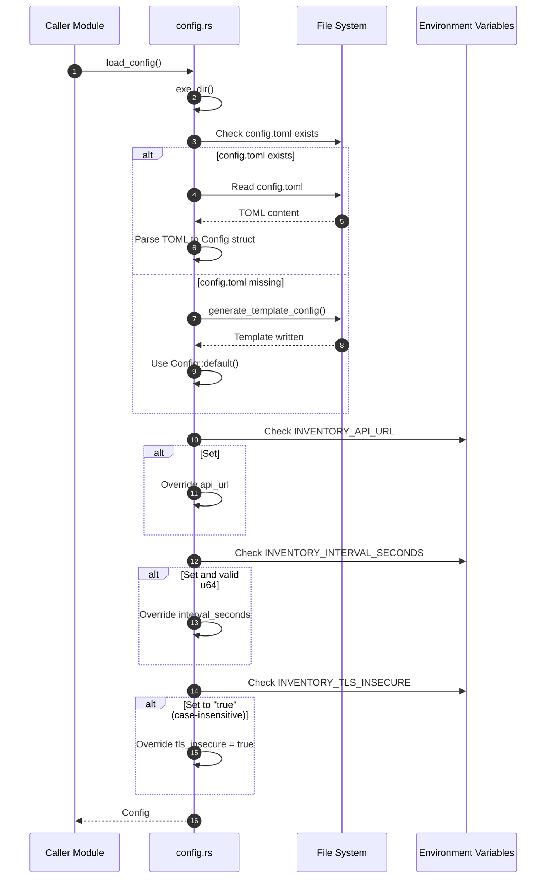

---

## Data Flow Summary

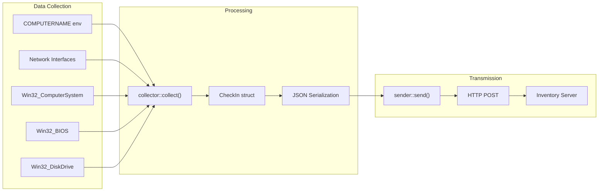

---

## Configuration Hierarchy

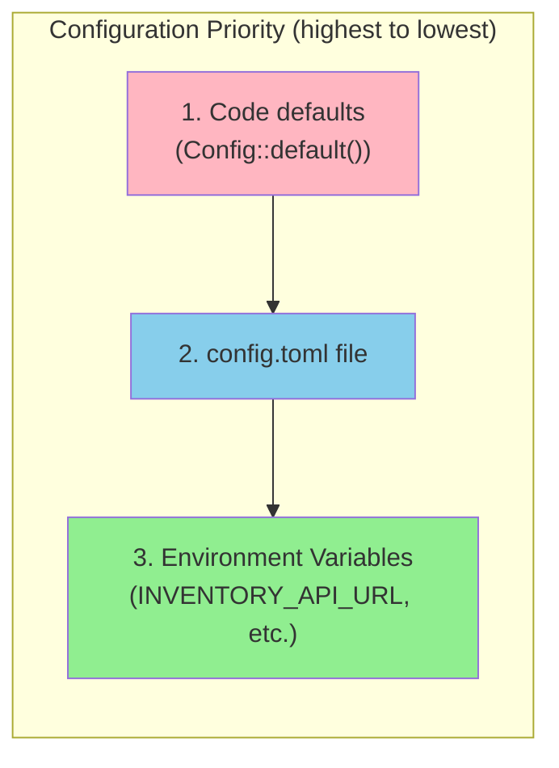

---

## Error Handling Strategy

| Component | Error Behavior |
|-----------|----------------|
| `config::load_config()` | Returns `Result<Config>` with context |
| `collector::collect()` | Returns `Result<CheckIn>` with WMI error context |
| `sender::send()` | Returns `Result<()>` with HTTP status and body |
| `service::run_service()` | Silently continues on collector/sender errors |
| `main::run_test_mode()` | Propagates errors to caller |
| `main::run_debug_mode()` | Propagates errors to caller |

---

## External Dependencies

| Crate | Purpose |
|-------|---------|
| `windows-service` | Windows Service API bindings |
| `wmi` | Windows WMI query interface |
| `tokio` | Async runtime (multi-thread, signals) |
| `reqwest` | HTTP client with rustls-tls |
| `serde` / `serde_json` | JSON serialization |
| `toml` | TOML configuration parsing |
| `chrono` | Timestamp generation (RFC3339) |
| `get_if_addrs` | Network interface enumeration |
| `anyhow` | Error handling with context |
